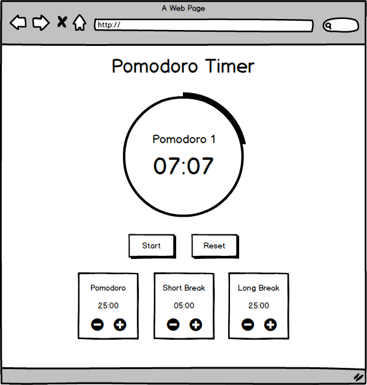

# Pomodoro időzítő
> Mini gyakorló projekt

Hozzátartozó magyarázó videó elérhető a YouTube-on: https://youtu.be/P1IIS7FRmvs

## Követelmények
- Visszaszámláló
- Start / Pause / Reset gomb
- Beállítások

### Visszaszámláló
- a visszaszámláló körül egy kör folyamatsan megtelítődik miközben a visszaszámláló közelít a 00:00-hoz
- amikor még nincs elindítva, akkor alapértelmezetten írja ki hogy Pomodoro 1, és alá pedig a beállított pomodoro időt
- ha pomodoro van, akkor a "Pomodoro X" -et írja a maradék idő fölé, az X helyére pedig hanyadik pomodoro körünk
- ha rövid szünet van, akkor a "Short Break" szöveget írja ki a maradék idő fölé
- ha hosszú szünet van, akkor a "Long Break" szöveget írja ki a maradék idő fölé
- minden 4. pomodoro lejárta után, hosszú szünet legyen

### Start / Pause / Reset gomb

Két gomb egymáss mellett: `Start` és `Reset` a visszaszámláló alatt.

- Start gomb lenyomásakor, a vissazszámlálás elindul
- Start gomb lenyomásakor, a Start gombra, Pause szöveget írjuk ki
- Pause gomb lenyomásakor, álljon meg a visszaszámlálás
- Pause gomb lenyomásakor, a Pause gombra, Start szöveget írjuk ki
- Start gomb lenyomásakor, ha éppen szüneteltetve van a visszaszámlálás, indítsuk el újra onnan ahol éppen meg volt állítva
- Reset gomb lenyomásakor álljon vissza minden alaphelyzetbe a visszaszámlálónál, a beállítások maradjanak

### Beállítások

Három doboz a gombok alatt, amelyekben beállíthatjuk meddig tartsanak az adott szakaszok. Mindegyikben láthajtuk a nevét a szaksznak és hogy hány percig tart. Alatta pedig két gomb, egy + és - gomb amivel perceket növelhetünk vagy csökkenthetünk az időn.

- A beállítások nem változtathatóak
  - ha már megy a visszaszámlálás
  - ha éppen szüneteltetve van a visszaszámlálás (tehát el volt indítva, de szüneteltetve lett, DE NEM resetelve)
  
- Bal oldali doboz: Pomodoro
  - Alapértelmezetten 25 perc
  - + gomb lenyomásával növeljük 1 percel
  - - gomb lenyomásával csökkentjük 1 percel
  
- Közpéső doboz: Short Break
  - Alapértelmezetten 5 perc
  - + gomb lenyomásával növeljük 1 percel
  - - gomb lenyomásával csökkentjük 1 percel  
  
- Közpéső doboz: Long Break
  - Alapértelmezetten 25 perc
  - + gomb lenyomásával növeljük 1 percel
  - - gomb lenyomásával csökkentjük 1 percel  

## Felület drótváz

## Megoldások
> Megcsináltad már ezt a feladatot és szeretnéd kitenni ide? Nyiss egy issue-t!
